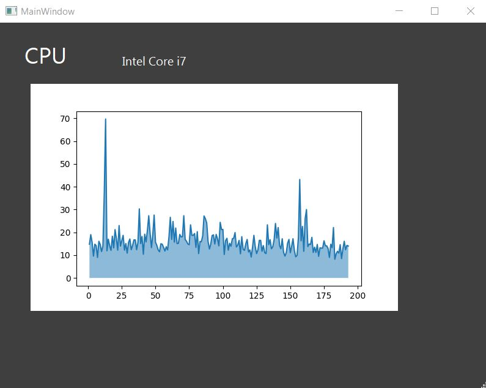

<h1>
In The Name Of ALLAH
</h1>
<h2>
Advanced Programming - Homework 7
</h2>
<h2>
Dr.Amir Jahanshahi
</h2>
<h3>
Deadline: 17 , day  - 23:59 

# Introduction
Hi all 🙋‍♂️
In this homework we see how to draw a plot in pyqt and simple thread in qt.

# Cpu Usage Monitoring

As you can see in above picture , we want to create simple cpu usage monitor that plot percentages of cpu usage per one second.

## Note:
your chart must be like picture or more beautiful than it.

## Hint:
You can see TA class session 13 which held at Wednesday(8 Day 1400).

